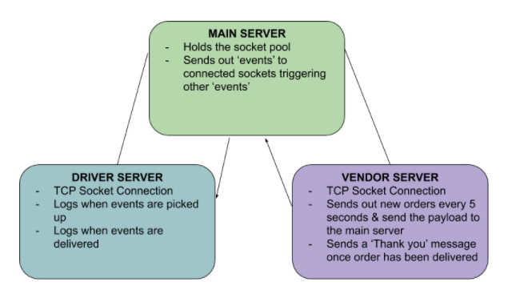

# LAB - Class 17

## Project Name: Socket Server App

## Author: 
- Sian Culligan

## Links and Resources
- [Sonia's Lecture Video](https://www.youtube.com/watch?v=T1JhVHGk-RA)
- [Faker Info](https://www.npmjs.com/package/faker)
- [Net Docs](https://node.readthedocs.io/en/latest/api/net/)

## Submission PR
- [Pull Request](https://github.com/SianCulligan/401Lab_17/pull/1)
- [Resubmit PR](https://github.com/SianCulligan/401Lab_17/pull/2)
- No .env

## How to initialize/run your application 
- Clone this repo
- Open 3 terminal windows, navigate one to the drive.js file, another to the vendor.js file, and the last to the server.js file
- 1. Start the server.js file by typing out ``node server.js``
- 2. Start the vendor.js file by typing out ``node vendor.js``
- 3. Start the driver.js file by typing out ``node driver.js``

## UML

